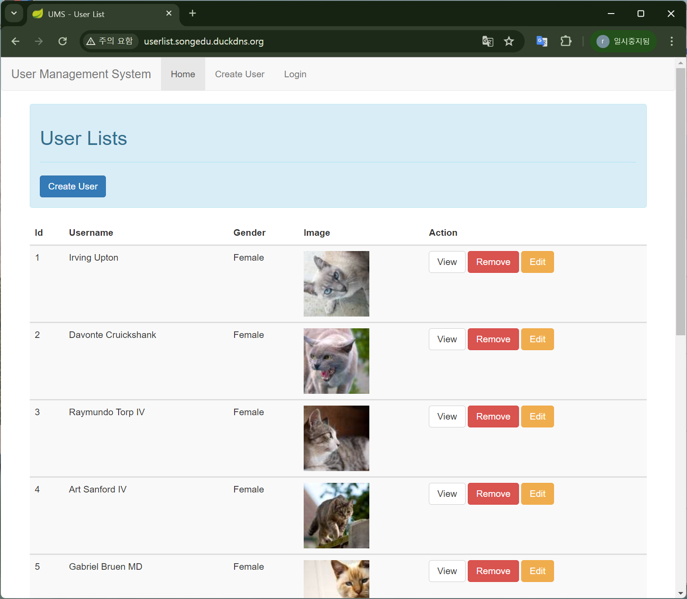
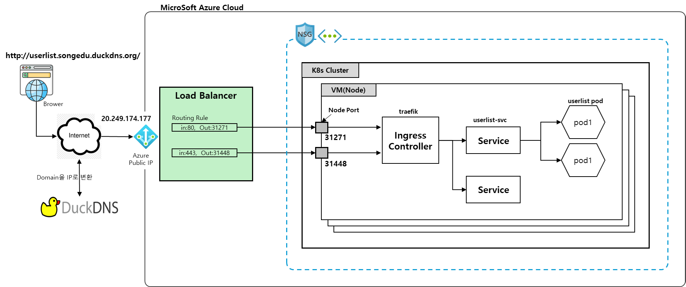
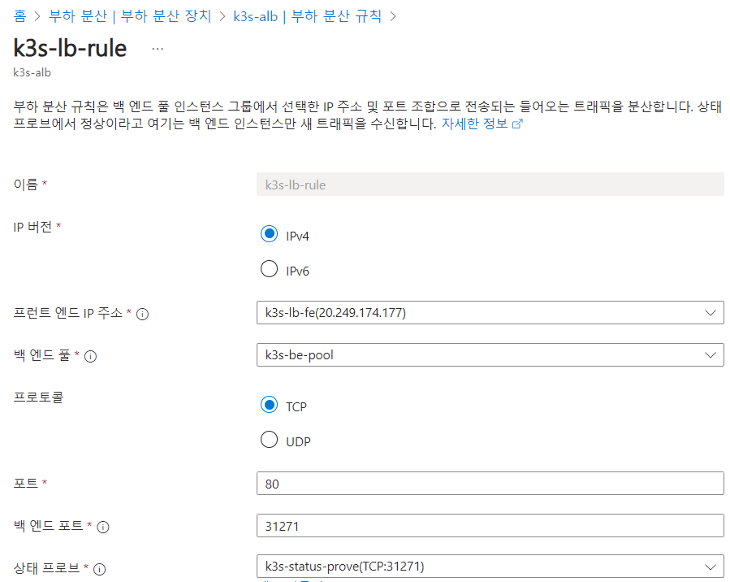

# < Kubernetes 구축 및 Traffic Flow 이해 >


# 1. k3s를 이용한 Kubernetes 구축


## 1) k3s 란?

> K3s - Lightweight Kubernetes


### (1) 개요

* Rancher 에서 만든 kubernetes 경량화 제품
* IoT 및 엣지 컴퓨팅을 위해 설계
* 설치가 간단하고 리소스 소비가 적기 때문에, 개발 환경이나 소규모 클러스터에서 특히 유용
* k3s 의미
  * k3s는 메모리 사용측면에서 K8s 의 절반의 크기 희망
  * k8s 는 총 10글자이며 k3s 는 총 5글자임


### (2) k3s 특징

- K3s는 쉬운 배포
- 낮은 설치 공간
  - kubernetes 대비 절반의 메모리 사용
  - 100MB 미만의 바이너리 제공
  - 최소 1GB RAM, 1vCPU 권장됨
- CNCF(Cloud Native Computing Foundation) 인증 Kubernetes 제품
- 일반적인 K8s 에서 작동하는 YAML을 이용할 수 있음


### (3) k3s 구조


- k3s 에서는 containerd 라는 Container runtime을 사용함


## 2) VM에 k3s 설치

### (1) master node - (SA)

> Stand Alone mode 로 설치

- k3s install

```sh
## root 권한으로 수행한다.
$ sudo -s


# k3s 설치
$ curl -sfL https://get.k3s.io | sh -s - --write-kubeconfig-mode 644


[INFO]  Finding release for channel stable
[INFO]  Using v1.23.6+k3s1 as release
…
[INFO]  systemd: Starting k3s       <-- 마지막 성공 로그

# 20초 정도 소요됨


# 확인1
$ k3s kubectl version
Client Version: v1.29.5+k3s1
Kustomize Version: v5.0.4-0.20230601165947-6ce0bf390ce3
Server Version: v1.29.5+k3s1

# Client 와 Server Version 이 각각 보인다면 설치가 잘 된 것이다.


# root shell 종료(일반사용자로 전환)
$ exit
```


### (2) [참고] 수동실행

설치가 안된다면 아래와 같이 수동실행 진행해 보자.

```sh
# root 권한으로

$ k3s server &
…
COMMIT 
…

# k3s 데몬 확인
$ ps -ef|grep k3s
root         590     405  0 13:05 pts/0    00:00:00 sudo k3s server
root         591     590 76 13:05 pts/0    00:00:26 k3s server
root         626     591  5 13:05 pts/0    00:00:01 containerd -c /var/lib/rancher/k3s/agent/etc/containerd/config.toml -a /run/k3s/containerd/containerd.sock --state /run/k3s/containerd --root /var/lib/rancher/k3s/agent/containerd
...

$ k3s kubectl version
Client Version: v1.28.6+k3s2
Kustomize Version: v5.0.4-0.20230601165947-6ce0bf390ce3
Server Version: v1.28.6+k3s2

```


### (3) kubeconfig 설정

일반 User가 직접 kubctl 명령 실행을 위해서는 kube config 정보(~/.kube/config) 가 필요하다.

k3s 를 설치하면 /etc/rancher/k3s/k3s.yaml 에 정보가 존재하므로 이를 복사한다. 또한 모든 사용자가 읽을 수 있도록 권한을 부여 한다.


- 일반 user 로 수행

* * kubectl 명령을 수행하기를 원하는 특정 사용자로 아래 작업을 진행한다.

```sh
## 일반 user 권한으로 실행   <-- 중요 ★★★

$ mkdir -p ~/.kube

$ cp /etc/rancher/k3s/k3s.yaml ~/.kube/config

$ ll ~/.kube/config
-rw-r--r-- 1 ktdseduuser ktdseduuser 2965 Jun  6 11:54 /home/ktdseduuser/.kube/config


# 보안을 위해 자신만 RW 권한 부여( 644 --> 600)
$ chmod 600 ~/.kube/config


$ ls -ltr ~/.kube/config
-rw------- 1 ktdseduuser ktdseduuser 2965 Jun  6 11:54 /home/ktdseduuser/.kube/config


## 확인
$ kubectl version
Client Version: v1.30.1
Kustomize Version: v5.0.4-0.20230601165947-6ce0bf390ce3
Server Version: v1.29.5+k3s1


$ kubectl get ns
NAME              STATUS   AGE
kube-system       Active   4m2s
kube-public       Active   4m2s
kube-node-lease   Active   4m2s
default           Active   4m2s


$ kubectl get nodes
NAME           STATUS   ROLES                  AGE    VERSION
ke-bastion03   Ready    control-plane,master   108s   v1.29.5+k3s1

```

이제 root 권한자가 아닌 다른 사용자도 kubectl 명령을 사용할 수 있다.


## 3) [참고] k3s 삭제

아직 삭제 금지

```sh
# root 권한으로
$ sudo -s

## k3s 삭제
$ sh /usr/local/bin/k3s-killall.sh
  sh /usr/local/bin/k3s-uninstall.sh

# 확인1
$ ps -ef|grep k3s

# 확인
$ systemctl status k3s


# 사용자 권한으로
$ eixt
```


# 2. [개인Cluster] Userlist 실습

Kubernetes 클러스터에서 트래픽이 어떻게 흐르는지 이해하는 것은 클러스터의 성능과 안정성을 유지하는 데 매우 중요한 포인트 이다.

Userlist 라는 APP을 배포하여 접근 하는 실습으로 수행해보자.


## 1) 개인별 Namespace ★★★

아래 정보를 참조하여 개인별 Namespace 정보를 확인하자.

* 수강생별 접속정보 :  시작전에 > 실습환경준비(Cloud) > 수강생별 Namespace 및 접속 서버 주소

```sh
## kubectl create ns [namespace_name]

## 자신만의 namespace 명으로 하나를 생성한다.
$ kubectl create ns user02

or

$ kubectl create ns user03

or

$ kubectl create ns user04
...


# ku 로 alias 선언
$ alias ku='kubectl -n user03'        #    <-- 자신의 namespace 명을 입력한다. 중요 ★★★

$ ku get pod
No resources found in user03 namespace.


```


### Alias 수정

kubectl 명령과 각종 namespace 를 매번 입력하기가 번거롭다면 위와 같이 alias 를 정의후 사용할 수 있으니 참고 하자.

적용하려면 source 명령을 이용한다.

```sh
## 일반 user 권한으로 실행


$ vi ~/env
----
alias k='kubectl'
alias ki='kubectl -n istio-system'
alias kb='kubectl -n bookinfo'
alias kii='kubectl -n istio-ingress'

alias ku='kubectl -n user03'         # <===  자신의 Namespace 로 변경하자.

#export KUBECONFIG=~/.kube/config-ktdseducluster
export KUBECONFIG=~/.kube/config

----


## alias 를 적용하려면 source 명령 수행
$ source ~/env
```


## 2) Userlist Deploy

kustomize 를 이용한다면 웹상에의 yaml 을 쉽게 이용할 수 있다.

github.com/ssongman/userlist 의 kustomize 를 이용해서 쉽게 배포해 보자.

```sh

# 배포
$ ku apply -k github.com/ssongman/userlist


# 확인
$ ku get all
NAME                           READY   STATUS    RESTARTS   AGE
pod/curltest                   1/1     Running   0          23h
pod/userlist-9fbfc64bc-8pczv   1/1     Running   0          19m
pod/userlist-9fbfc64bc-9vpwc   1/1     Running   0          6s

NAME                   TYPE        CLUSTER-IP      EXTERNAL-IP   PORT(S)   AGE
service/userlist-svc   ClusterIP   10.43.113.209   <none>        80/TCP    23h

NAME                       READY   UP-TO-DATE   AVAILABLE   AGE
deployment.apps/userlist   2/2     2            2           19m

NAME                                 DESIRED   CURRENT   READY   AGE
replicaset.apps/userlist-9fbfc64bc   2         2         2       19m


```


## 3) Ingress

ingress 를 생성해 보자.

자신 VM의 공인IP로 변경해야 한다.

```sh


$ cat <<EOF | ku create -f -
apiVersion: networking.k8s.io/v1
kind: Ingress
metadata:
  name: userlist-ingress
spec:
  ingressClassName:  "traefik"
  rules:
  - host: "userlist.[my-public-ip].nip.io"    #  <-- 자신의 공인 IP 로 변경
    http:
      paths:
      - path: /
        pathType: Prefix
        backend:
          service:
            name: userlist-svc
            port:
              number: 80
EOF


# 예
# 변경전 userlist.[my-public-ip].nip.io
# 변경후 userlist.4.217.252.117.nip.io       #  <-- 자신의 공인 IP 로 변경


# ingress 생성 확인

$ ku get ingress
NAME               CLASS     HOSTS                           ADDRESS    PORTS   AGE
userlist-ingress   traefik   userlist.4.217.252.117.nip.io   10.0.0.9   80      9m18s

```


## 4) 접속 확인

traefik node port 를 확인후 curl로 테스트 해보자.

```sh
# traefik node node port 확인
$ kubectl -n kube-system get svc traefik
NAME             TYPE           CLUSTER-IP      EXTERNAL-IP   PORT(S)                      AGE
traefik          LoadBalancer   10.43.2.251     10.0.0.9      80:31571/TCP,443:32207/TCP   23h


# < VM 에서 직접 확인 >

# 1) localhost로 확인
$ curl http://localhost:31571/users/1 -H "Host:userlist.4.217.252.117.nip.io"
{"id":1,"name":"Noemi Abbott","gender":"F","image":"/assets/image/cat1.jpg"}

$ curl http://localhost:80/users/1 -H "Host:userlist.4.217.252.117.nip.io"
{"id":1,"name":"Noemi Abbott","gender":"F","image":"/assets/image/cat1.jpg"}


# 2) node IP 로 확인
# IP 확인
$ ifconfig eth0
eth0: flags=4163<UP,BROADCAST,RUNNING,MULTICAST>  mtu 1500
        inet 10.0.0.9  netmask 255.255.255.0  broadcast 10.0.0.255
        
# IP : 10.0.0.9


# node IP 로 접근해도 동일한 결과를 받을 수 있다.
$ curl http://10.0.0.9:31571/users/1 -H "Host:userlist.4.217.252.117.nip.io"
{"id":1,"name":"Jacinto Pollich IV","gender":"F","image":"/assets/image/cat1.jpg"}

$ curl http://10.0.0.9:80/users/1 -H "Host:userlist.4.217.252.117.nip.io"
{"id":1,"name":"Jacinto Pollich IV","gender":"F","image":"/assets/image/cat1.jpg"}


# 3) node public IP 로 확인
$ curl http:/4.217.252.117:31571/users/1 -H "Host:userlist.4.217.252.117.nip.io"
# 방화벽이 막혀 있어서 불가

$ curl http:/4.217.252.117:80/users/1 -H "Host:userlist.4.217.252.117.nip.io"
{"id":1,"name":"Jacinto Pollich IV","gender":"F","image":"/assets/image/cat1.jpg"}


# 4) domain 으로 확인
$ curl http:/userlist.4.217.252.117.nip.io:31571/users/1
# 방화벽이 막혀 있어서 불가

$ curl http:/userlist.4.217.252.117.nip.io:80/users/1
{"id":1,"name":"Jacinto Pollich IV","gender":"F","image":"/assets/image/cat1.jpg"}


# 5) web brower에서 domain 으로 확인
http:/userlist.4.217.252.117.nip.io:31571/users/1
# 방화벽이 막혀 있어서 불가

http:/userlist.4.217.252.117.nip.io:80/users/1
{"id":1,"name":"Jacinto Pollich IV","gender":"F","image":"/assets/image/cat1.jpg"}


http://userlist.4.217.252.117.nip.io/
# 가능

```


* 결론
  * Node 에서 직접 Node Port 나 80 Port로도 접근하는 것은 문제가 없다.
  * 외부망을 통과하는 Call Test시에는 방화벽이슈로 Node Port 연결은 불가하다.
  * 외부망 경유라도 80은 방화벽을 열었기 때문에 연결 가능하다.


위와 같이 결론을 내릴 수 있다.

트래픽이 어떻게 외부망에에서 부터 유입되어 POD 까지 전달되는지는 아래에서 좀더 살펴보자.


# 3. [EduCluster] Traffic Flow 이해

Cluster 외부에서 부터 출발한 트래픽이 어떻게 흘러가는지 살펴보자.

EduCluster 에 이미 설치되어 있는 Userlist 를 확인해 보자.


## 1) Userlist 접속

개인 Browser 에서 아래 URL 로 접속을 시도해 보자.

```sh

https://userlist.songedu.duckdns.org

```


아래와 같은 화면이 리턴될 것이다.




어떤 흐름으로 Userlist 페이지가 응답하는지 살펴보자.


## 2)  Userlist Request Traffic flow

userlist 는 app 은 Azure Cloud 에서 서비스 되고 있으며 아래와 같은 아키텍처로 표현할 수 있다.




각 지점별로 진행되는 과정을 살펴보자.

* Browser 에서 URL 을 입력
* DuckDNS 에서URL 을 IP로 변환
* 해당 IP 로 Request
* Azure Load Balancer 에서 이미 정해진 Rule 에 의해서 특정 Node 의 Nodeport 로 binding되어 Ingress Controller 로 연결

* Ingress Controller 에서는 선언된 ingress  yaml 에 의해서 Service 로 연결
* Service 에서는 selector 에 의해서 해당 Pod 로 RoundRobbin 방식으로 연결
* Pod 에서는 요청값을 해석하여 응답


## 3) Azure Load Balacner

Load Balancer 에서는 프런트엔드 와 백엔드 풀을 연결해주는 역할을 한다.

이때 백엔드 풀에 등록된 Node 는 한개 이상이므로 자연스럽게 부하가 분산되는 효과를 가진다.





## 4) Ingress Controller 확인

인그레스는 클러스터 내의 서비스에 대한 외부 접근을 관리하는 API 오브젝트이며, 일반적으로 HTTP를 관리한다.

인그레스는 부하 분산, SSL, 명칭 기반의 가상 호스팅을 제공할 수 있다.

인그레스는 클러스터 외부에서 클러스터 내부 서비스로 HTTP와 HTTPS 경로를 노출한다. 

트래픽 라우팅은 인그레스 리소스에 정의된 규칙에 의해 컨트롤된다.

- ingress architecture


위 인그레스는 반드시 인그레스 컨트롤러가 있어야 한다.  그 인그레스 컨트롤러는 클러스터별로 사용자가 설정할 수 있으며 보통 nginx, haproxy, traefik 등과 같이 proxy  tool 을 주로 사용한다.

예를들면, Openshift 의 경우 haproxy 로 구성된 route 라는 오브젝트를 제공한다. 


우리가 실습하고 있는 환경에는 traefik(https://traefik.io/) 이라는 ingress controller 가 설치되어 있다.

```sh
$ kubectl -n kube-system get svc traefik
NAME      TYPE           CLUSTER-IP     EXTERNAL-IP                  PORT(S)                      AGE
traefik   LoadBalancer   10.43.241.86   10.0.0.4,10.0.0.5,10.0.0.6   80:31271/TCP,443:31448/TCP   6d19h

```

node port 가  31271/31448 로 열려 있는것을 알 수 있다.  그러므로 클러스터 외부에서 접근할때는 해당 node port 로 접근이 가능하다.


또한 traefik 이라는 service 는 LoadBalancer type 으로 선언되어 있어서 모든 노드에서 80/443 port 가 hostport 로 binding 되어 있다.

그러므로 node port 뿐 아니라 Node 의 IP의 80/443 으로 접근한다면 traefik service 로 연결되도록 설정되어 있다.

daemonset 으로 설정되어 있어서 모든 node 에 설정된다.

아래 yaml 을 살펴보자.

```sh
# daemonset 확인
$ kubectl -n kube-system get ds
NAME                      DESIRED   CURRENT   READY   UP-TO-DATE   AVAILABLE   NODE SELECTOR   AGE
svclb-traefik-3f94f6da    3         3         3       3            3           <none>          6d19h


# daemonset yaml 확인
$ kubectl -n kube-system get ds svclb-traefik-3f94f6da -o yaml
...
spec:
  template:
    spec:
      containers:
      - env:
        - name: DEST_PORT
          value: "80"
        - name: DEST_IPS
          value: 10.43.241.86    # traefik service ip 로 설정
        ports:
        - containerPort: 80
          hostPort: 80           # hostport 로 선언되어 있다.
          name: lb-tcp-80
          protocol: TCP
      - env:
        - name: DEST_PORT
          value: "443"
        - name: DEST_IPS
          value: 10.43.241.86    # traefik service ip 로 설정
        ports:
        - containerPort: 443
          hostPort: 443          # hostport 로 선언되어 있다.
          name: lb-tcp-443
          protocol: TCP
...

```

그러므로 Node 의  80/443 으로 접근시 traefik service 로 연결되는 구조이다.

본 실습에서는 80/443 이 아닌 31271/31448 번으로 연결되어 있음을 참고하자.


## 5) Ingress

userlist-Ingress를 살펴보자.

```sh

$ kubectl -n yjsong get ingress  userlist-ingress -o yaml

apiVersion: networking.k8s.io/v1
kind: Ingress
metadata:
  creationTimestamp: "2024-05-31T16:37:20Z"
  generation: 2
  name: userlist-ingress
  namespace: yjsong
  resourceVersion: "591876"
  uid: 5dd6db30-206c-4f35-89ab-f33a9e569daf
spec:
  ingressClassName: traefik
  rules:
  - host: userlist.songedu.duckdns.org
    http:
      paths:
      - backend:
          service:
            name: userlist-svc
            port:
              number: 80
        path: /
        pathType: Prefix
status:
  loadBalancer:
    ingress:
    - ip: 10.0.0.4
    - ip: 10.0.0.5
    - ip: 10.0.0.6

```

* ingress controller 는 위 ingress yaml 을 통해서 traffic 을 라우팅 한다.
* domain이 userlist.songedu.duckdns.org 라면 userlist-svc 로 연결시켜준다.


## 6) Service 

```sh
$ kubectl -n yjsong get svc  userlist-svc -o yaml
apiVersion: v1
kind: Service
metadata:
  creationTimestamp: "2024-05-31T16:35:10Z"
  name: userlist-svc
  namespace: yjsong
  resourceVersion: "16970"
  uid: 5f984025-10f2-4ca8-8fbd-12dff1b4c3c9
spec:
  clusterIP: 10.43.97.10
  clusterIPs:
  - 10.43.97.10
  internalTrafficPolicy: Cluster
  ipFamilies:
  - IPv4
  ipFamilyPolicy: SingleStack
  ports:
  - name: http
    port: 80
    protocol: TCP
    targetPort: 8181
  selector:
    app: userlist
  sessionAffinity: None
  type: ClusterIP
status:
  loadBalancer: {}

```

* 서비스로 유입된 트래픽은 selector에 의해서 POD로 연결된다.
* 동일 Namespace 에 있는 POD 중 label 이 app: userlist 가 있는 POD 가 destination 대상이 된다.
* 트래픽이 유입될 때마다 RoundRobbin 방식으로 각 POD들로 연결된다.


## 7) 결론

* Cloud 환경에서의 Kubernetes 트래픽 흐름을 이해하는 것은 클러스터의 네트워크 구성 및 문제 해결에 큰 도움이 된다.
* 이를 통해 더 효율적이고 안정적인 클러스터를 운영할 수 있다.