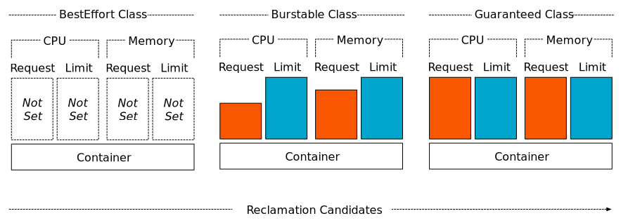

# Kubernetes 효율적인 리소스 관리


# 1. 리소스 관리 개념 이해


## 1) Kubernetes에서의 리소스 관리란?

Kubernetes에서 리소스 관리란 클러스터 내의 CPU, 메모리와 같은 컴퓨팅 자원을 효율적으로 사용하도록 관리하는 것을 의미한다. 이를 통해 애플리케이션이 안정적이고 예측 가능하게 동작하도록 보장한다.


### 리소스 요청과 제한

- **리소스 요청 (Resource Requests)**
  - 컨테이너가 안정적으로 실행되기 위해 필요한 최소한의 리소스를 지정
  - requests.memory 값의 여유 메모리가 있는 노드를 선택하여 스케쥴링 함
  - Pod 실행될때 해당 값만큼 점유하지는 않으며 실제 실행되는 값과는 차이가 있음

- **리소스 제한 (Resource Limits)**
  - 컨테이너가 사용할 수 있는 최대 리소스를 지정
  - 컨테이너 내 메모리 점유를 제한하므로써 다른 컨테이너 및 다른 POD, Node 에 영향을 미치지 않도록 함


#### 예제

```sh

apiVersion: v1
kind: Pod
metadata:
  name: resource-demo
spec:
  containers:
  - name: demo-container
    image: nginx
    resources:
      requests:
        memory: "64Mi"
        cpu: "250m"
      limits:
        memory: "128Mi"
        cpu: "500m"

```

- requests.memory가 64Mi 이므로 64Mi의 여유가 있는 Node 에 POD 를 실행 시킨다.
- limits.memory 128Mi 이므로 nginx Container 가 128Mi 보다 커지지 않도록 제한한다.
- 만약 이보다 많은 메모리를 사용하고 하는 경우 OOM 이 발생하고 Container 는 재시작된다.


# 2. limit / Request 확인


## 1)  limit / Request 확인

limit / Request memory 를 좀더 정확히 이해하기 위해서 nginx Sample을 배포후 메모리 사용율과 Grafana에서 리소스 Limit 과 request 설정값을 확인해 보자.


### nginx sample

```sh

# nginx  POD 실행
$ cat <<EOF | ku apply -f -
apiVersion: v1
kind: Pod
metadata:
  name: resource-nginx-demo
spec:
  containers:
  - name: demo-container
    image: nginx 
    resources:
      requests:
        memory: "64Mi"
        cpu: "250m"
      limits:
        memory: "128Mi"
        cpu: "500m"
EOF


```


메모리 실제 사용량 확인

```sh
# POD 
$ kubectl  top pod
NAME                       CPU(cores)   MEMORY(bytes)
resource-nginx-demo        0m           2Mi

```

* 64Mi 만큼의 여유 공간의 Node 를 검사후 POD 가 실행됨
* 실제 사용량은 2Mi 임


### Grafana 확인

grafana 에서 확인해보자.

* 개인별 Grafana 사이트로 이동
* 메뉴 : Home > Dashboards > Kubernetes / Compute Resources / Namespace (Pods)
* Namesapce : user03
* memory Request, Limit 을 확인한다.


### Clean Up

```sh
$ ku delete pod resource-demo

```


## 2) limit 초과시 OOM 구현

`limits.memory`로 설정된 값을 초과하면 컨테이너는 OOM(Out of Memory) 에러를 발생시키고, Kubernetes는 해당 컨테이너를 재시작 시킨다.

`limits.memory`를 좀더 정확히 이해하기 위해서 실제 실습을 수행해보자.


### **Pod 정의 및 배포**

```sh

# python POD 실행
$ cat <<EOF | ku apply -f -
apiVersion: v1
kind: Pod
metadata:
  name: resource-demo
spec:
  containers:
  - name: demo-container
    image: python:alpine3.20
    args:
    - sleep
    - 365d
    resources:
      requests:
        memory: "64Mi"
        cpu: "250m"
      limits:
        memory: "512Mi"
        cpu: "500m"
EOF


```


메모리 실제 사용량 확인

```sh
# POD 
$ ku top pod resource-demo
NAME            CPU(cores)   MEMORY(bytes)
resource-demo   0m           0Mi

```

사용량은 거의 없다.


### 메모리 사용량 증가 스크립트 작성

메모리를 인위적으로 증가시키기 위한 Python 스크립트를 작성한다. 이 스크립트는 큰 배열을 생성하여 메모리를 소모한다.

`memory_hog.py` 파일을 작성

```sh

$ ku exec -it resource-demo -- sh


# PS1 변수 설정 (색상이 포함된 설정)
$ PS1='\[\e[32m\]\u@\h \[\e[33m\]\w\[\e[0m\]\$ '


$ mkdir -p ~/app/src
  cd ~/app/src

$ cat > memory_hog.py
```


```python
import time

def memory_hog():
    obj = []
    while True:
        obj.append(' ' * ((2**20) * 10) )  # 10 MiB씩 메모리를 채움
        time.sleep(1)                      # 1초 대기, 즉,1총에 10MiB 씩 증가한다.
        print(f"obj length: {len(obj)}")

if __name__ == "__main__":
    memory_hog()
```


```sh
Ctrd+D
```


### 실행 및 모니터링

효과적인 모니터링을 위해 terminal 4개를 준비한다.


#### terminal 1

* k9s 실행


#### terminal 2

* top pod  명령을 1초에 한번씩 실행

* ```sh
  
   while true; do ku top pod resource-demo ; sleep 1; echo; done
    
  ```

  

#### terminal 3

* events 를 확인한다.

* ```sh
  
  $ ku events -w
  
  ```

  

#### terminal 4

* 메모리 사용량 증가 스크립트 실행
* 

```sh

$ cd ~/app/src

$ python memory_hog.py

```


1초에 10MiB 씩 증가하므로 약 50초 이후에  OOM  Kill 이 발생할 것이다.


#### OOM 발생 확인

몇 초 후, `kubectl describe pod resource-demo` 명령을 사용하여 OOM 이벤트를 확인할 수 있다.

```sh

$ ku describe pod resource-demo

Containers:
  demo-container:
    ...
    State:          Running
    Last State:     Terminated
      Reason:       OOMKilled
      Exit Code:    137

```


또한 `kubectl get events` 명령을 사용하여 클러스터 이벤트를 확인할 수 있다.

```

ku get events --sort-by=.metadata.creationTimestamp
ku get events -w

```


### Clean Up

```sh
$ ku delete pod resource-demo

```


## 3) 결론

리소스의 적절한 요청과 제한 설정으로 Node 및 다른 AP를 보호 하는등 안정적인 시스템 운영을 할 수 있다.


# 3. 리소스 쿼터


## 1) 리소스 쿼터

리소스 쿼터는 네임스페이스 단위로 리소스 사용량을 제한하여, 클러스터의 특정 네임스페이스가 전체 리소스를 독점하지 않도록 한다.


## 2) 샘플 Yaml

```yaml
apiVersion: v1
kind: ResourceQuota
metadata:
  name: quota-demo
spec:
  hard:
    pods: "10"
    requests.cpu: "4"
    requests.memory: "8Gi"
    limits.cpu: "10"
    limits.memory: "16Gi"
```

**pods: "10"**

- 네임스페이스 내에서 생성할 수 있는 최대 Pod 수를 10개로 제한
- 리소스가 과도하게 사용되지 않도록 
- 이를 통해 네임스페이스 간 리소스 분쟁을 방지할 수 있음.

**requests.cpu: "4"**

- 모든 Pod가 요청할 수 있는 총 CPU의 최대 값임
- 여기서는 총 4개의 CPU 코어를 요청할 수 있음

**requests.memory: "8Gi"**

- 모든 Pod가 요청할 수 있는 총 메모리의 최대 값
- 여기서는 총 8GiB의 메모리를 요청할 수 있음
- 클러스터 스케줄러가 Pod를 배치할 때 사용되며, 네임스페이스가 과도한 메모리 자원을 요청하여 다른 네임스페이스에 영향을 미치지 않도록 한다.

**limits.cpu: "10"**

- 모든 Pod가 사용할 수 있는 총 CPU의 최대 값
- 여기서는 총 10개의 CPU 코어를 사용할 수 있음

**limits.memory: "16Gi"**

- 모든 Pod가 사용할 수 있는 총 메모리의 최대 값
- 여기서는 총 16GiB의 메모리를 사용할 수 있음
- Pod가 실행 중에 사용할 수 있는 CPU/Memory 자원의 상한선을 지정하여, 다른 네임스페이스에 영향을 미치지 않도록 한다.


## 3) 기타

네임스페이스에 ResourceQuota를 설정하면, Pod를 생성할 때 해당 ResourceQuota에서 요구하는 리소스 요청 및 제한을 반드시 명시해야 한다. 


# 4. QoS Class

> Kubernetes QoS Class와 Pod 우선순위


## 1) QoS Class

### QoS Class란 무엇인가?

QoS (Quality of Service) Class는 Kubernetes에서 Pod의 리소스 사용 우선순위를 나타내는 분류이다. 이는 클러스터 내에서 리소스 경합이 발생할 때 어떤 Pod가 먼저 자원을 확보하고, 어떤 Pod가 퇴출될지를 결정하는 데 중요한 역할을 한다.


### QoS Class 결정 방법

- **Guaranteed**
  - 모든 컨테이너에 대해 `requests`와 `limits`가 동일하게 설정된 경우.
  - 보통 PRD 환경에서 지정한다.
  - 테스트 환경에서 성능테스트(SPT)를 충분히 수행한후 컨테이너별 리소스를 식별후 지정한다.
- **Burstable**
  - 일부 컨테이너에 `requests`와 `limits`가 설정되었지만, 모든 컨테이너에 대해 동일하지 않은 경우.
  - 보통 TEST 환경에서 지정한다.
- **BestEffort**: 모든 컨테이너에 `requests`와 `limits`가 설정되지 않은 경우.
  - 컨테이너별 리소스 수치를 알기 힘든 DEV 환경에서 지정한다.





## 2) Pod 우선순위

### QoS Class와 Pod 우선순위 간의 관계

- **Guaranteed POD** 
  - 가장 높은 우선순위를 가진다. 리소스가 부족할 때도 최우선적으로 보호된다.
- **Burstable POD**
  - 중간 우선순위를 가진다. 리소스가 충분할 때는 사용할 수 있지만, 부족할 때는 퇴출될 수 있다.
- **BestEffort POD**
  - 가장 낮은 우선순위를 가진다. 리소스가 부족할 때 가장 먼저 퇴출된다.


## 3) 결론

Kubernetes는 Node Pressure상황(예를 들어 메모리 부족이나 디스크 압박 상황) 에서 QoS Class를 고려하여 Pod를 Eviction(퇴출)한다. 이 경우, BestEffort Pod가 먼저 퇴출되고, 그 다음 Burstable Pod가 퇴출된다. Guaranteed Pod는 가장 마지막에 퇴출된다.

이런 경우를 대비하여 중요한 서비스는 Guaranteed QoS Class로 설정하여, 리소스 부족 상황에서도 안정적으로 동작할 수 있도록 보장할 수 있다.


# 5. HPA (AutoScaling)

> Horizontal Pod Autoscaler (HPA)


## 1) HPA 소개

### HPA란 무엇인가?

Horizontal Pod Autoscaler(HPA)는 Kubernetes에서 워크로드에 따라 자동으로 Pod의 수를 조절하는 기능다. HPA는 CPU 사용량, 메모리 사용량 등 메트릭을 모니터링하여, 필요에 따라 Pod의 수를 증가 또는 감소시킨다.


### HPA의 동작 원리

- HPA는 지정된 메트릭(CPU, 메모리 등)을 기반으로 Pod의 수를 자동으로 스케일링 한다.
- 메트릭 서버(Metrics Server)가 클러스터 내의 메트릭 데이터를 수집하고, HPA는 이 데이터를 사용하여 스케일링 결정을 내린다.

### HPA의 장점

- 워크로드에 따라 자동으로 리소스를 할당하여 효율성을 높인다.
- 수동으로 Pod의 수를 조절할 필요 없이 자동으로 확장/축소할 수 있다.
- 서비스 가용성을 높이고, 리소스를 절약할 수 있다.


## 2) HPA 설정 및 실습

HPA를 설정할 Deployment를 생성한다. Nginx를 사용하여 간단한 웹 서버를 배포한다.

### **Deployment / Svc 배포**

```yaml

$ cat <<EOF | ku apply -f -
apiVersion: apps/v1
kind: Deployment
metadata:
  name: nginx-deployment
  labels:
    app: nginx-deployment
spec:
  replicas: 1
  selector:
    matchLabels:
      app: nginx-deployment
  template:
    metadata:
      labels:
        app: nginx-deployment
    spec:
      containers:
      - name: nginx-deployment
        image: nginx
        resources:
          requests:
            cpu: "100m"
          limits:
            cpu: "200m"
        ports:
        - containerPort: 80
EOF


$ cat <<EOF | ku apply -f -
apiVersion: v1
kind: Service
metadata:
  name: nginx-deployment-svc
spec:
  ports:
  - name: http
    port: 80
    protocol: TCP
    targetPort: 80
  selector:
    app: nginx-deployment
  type: ClusterIP
EOF

```


### **HPA 설정**

HPA를 설정하여 CPU 사용량에 따라 자동으로 스케일링되도록 합니다.


```yaml
$ cat <<EOF | ku apply -f -
apiVersion: autoscaling/v1
kind: HorizontalPodAutoscaler
metadata:
  name: nginx-hpa
spec:
  scaleTargetRef:
    apiVersion: apps/v1
    kind: Deployment
    name: nginx-deployment
  minReplicas: 1
  maxReplicas: 5
  targetCPUUtilizationPercentage: 50
EOF  
  
```

* POD 의 requests.cpu 값에 50% 가 넘으면 Pod 가 증가된다.
* 만약 다수개의 POD 가 존재한다면 requests.cpu 의 평균값이 기준이 된다.


### 부하 발생기 배포

Apache Bench tool 을 배포한다.

```sh

$ cat <<EOF | ku apply -f -
apiVersion: v1
kind: Pod
metadata:
  name: load-generator
spec:
  containers:
  - name: apache-bench
    image: jordi/ab
    command:
    - "sleep"
    - "365d"
EOF


# 부하발생기 POD 내부로 진입
$ ku exec -it load-generator -- sh


```


### Apache Bench tool 이란?

Apache Bench (ab) 툴은 HTTP 서버의 성능을 테스트하기 위해 사용되는 CLI 기반 도구이다.

이를 통해 특정 URL에 대해 다수의 요청을 보내고, 응답 시간과 처리량 등의 성능 지표를 측정할 수 있다.

```sh


# ab명령을 사용하여 10개의 동시접속으로 1000개의 요청을 보냄
$ ab -n 1000 -c 10 http://nginx-deployment-svc/

This is ApacheBench, Version 2.3 <$Revision: 1826891 $>
Copyright 1996 Adam Twiss, Zeus Technology Ltd, http://www.zeustech.net/
Licensed to The Apache Software Foundation, http://www.apache.org/

Benchmarking nginx-deployment-svc (be patient).....done


Server Software:        nginx/1.27.0
Server Hostname:        nginx-deployment-svc
Server Port:            80

Document Path:          /
Document Length:        615 bytes

Concurrency Level:      1
Time taken for tests:   0.109 seconds
Complete requests:      100
Failed requests:        0
Total transferred:      84800 bytes
HTML transferred:       61500 bytes
Requests per second:    915.01 [#/sec] (mean)
Time per request:       1.093 [ms] (mean)
Time per request:       1.093 [ms] (mean, across all concurrent requests)
Transfer rate:          757.74 [Kbytes/sec] received

Connection Times (ms)
              min  mean[+/-sd] median   max
Connect:        0    0   0.0      0       0
Processing:     0    1   4.9      0      50
Waiting:        0    1   4.9      0      49
Total:          0    1   4.9      0      50

Percentage of the requests served within a certain time (ms)
  50%      0
  66%      0
  75%      1
  80%      1
  90%      1
  95%      1
  98%      5
  99%     50
 100%     50 (longest request)


```


### 부하 발생

다음 명령을 실행하여 부하를 발생시킨다.

```sh

# ab 명령을 무한반복으로 수행한다.
$ while true; do ab -n 1000 -c 10 http://nginx-deployment-svc/; done


## 스케일링이 확인되고 나면 Ctrl + C 로 중단 시켜야 한다.
```


### 스케일링 확인

HPA가 Pod를 자동으로 스케일링하는지 확인한다.

```sh

$ ku get hpa
NAME        REFERENCE                     TARGETS   MINPODS   MAXPODS   REPLICAS   AGE
nginx-hpa   Deployment/nginx-deployment   0%/50%    1         5         5          51m


# 증가된 Pod수 확인
$ ku get pod
NAME                                READY   STATUS    RESTARTS        AGE
load-generator                      1/1     Running   0               40m
nginx-deployment-5646549dc8-tfgx9   1/1     Running   0               31m
nginx-deployment-5646549dc8-9lcbv   1/1     Running   0               3m1s
nginx-deployment-5646549dc8-tt9ss   1/1     Running   0               3m1s
nginx-deployment-5646549dc8-wmzpj   1/1     Running   0               2m46s
nginx-deployment-5646549dc8-8bxjc   1/1     Running   0               2m16s

```

- 부하가 생성되면 HPA가 CPU 사용량을 모니터링하여 필요한 경우 Pod의 수를 증가시킨다.
- 부하가 감소하면 HPA는 Pod의 수를 줄인다.


### Clean Up

```sh

$
ku delete pod load-generator
ku delete hpa nginx-hpa
ku delete deployment nginx-deployment
ku delete svc nginx-deployment-svc

```


## 3) 결론

Horizontal Pod Autoscaler(HPA) 에 대한 개념이해와 HPA 설정으로 자동 스케일링 실습을 수행했다.

HPA는 워크로드에 따라 리소스를 효율적으로 관리하는 데 중요한 도구이다.

